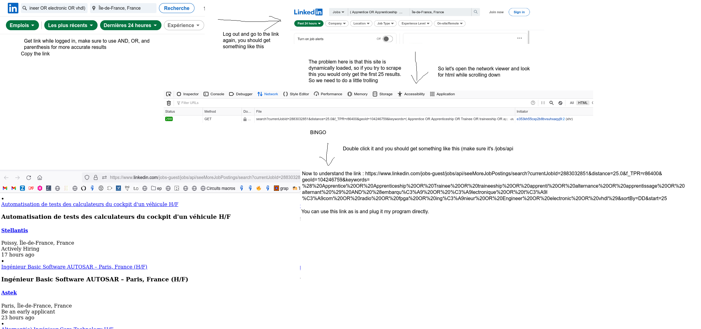

# A linkedIn job scraper
... That sends new job listings to you on Telegram
# How it works
I use
[Go-Colly](https://github.com/gocolly/colly)
to scrape search webpages and put the job offers in a csv file. I then compare it to a previous file that has the scraped jobs that I got before. 
I sort these two files and extract the difference between them then pipe the
output to a bot that reads it and sends it to me through telegram.

I also made a small bash script so that I can schedule this to execute every hour using `cron`.

# How do I use it
So you need 2 things, a telegram bot and your search criteria.
## Search criteria
Below is an image explaining what to do :

You can take these links and plug them in scrape.go (the end of the file).

## A telegram bot
Check 
[telegram's guide](https://core.telegram.org/bots)
on making bots to get your bot token. There's also
[an example](https://go-telegram-bot-api.dev/)
using the same library I use. Use the example to get your chatID, you'll need it to send messages unprompted.

# Automating it
First of all, don't forget to change the path to where you want your csv files to be in `jobscrape.sh`.

You can put these binaries in your /usr/local/bin and create a
[cronjob](https://opensource.com/article/21/7/cron-linux)
To execute every hour. 
